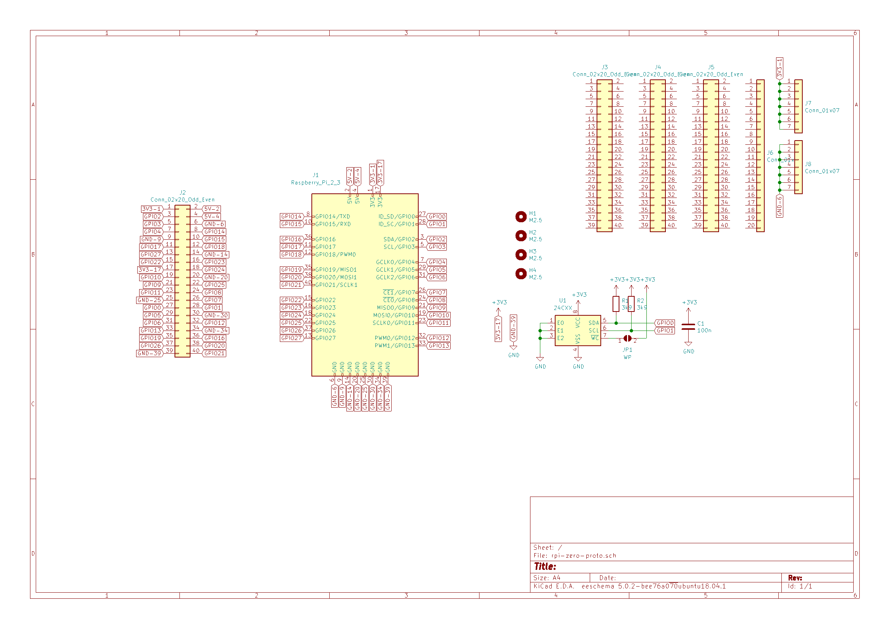
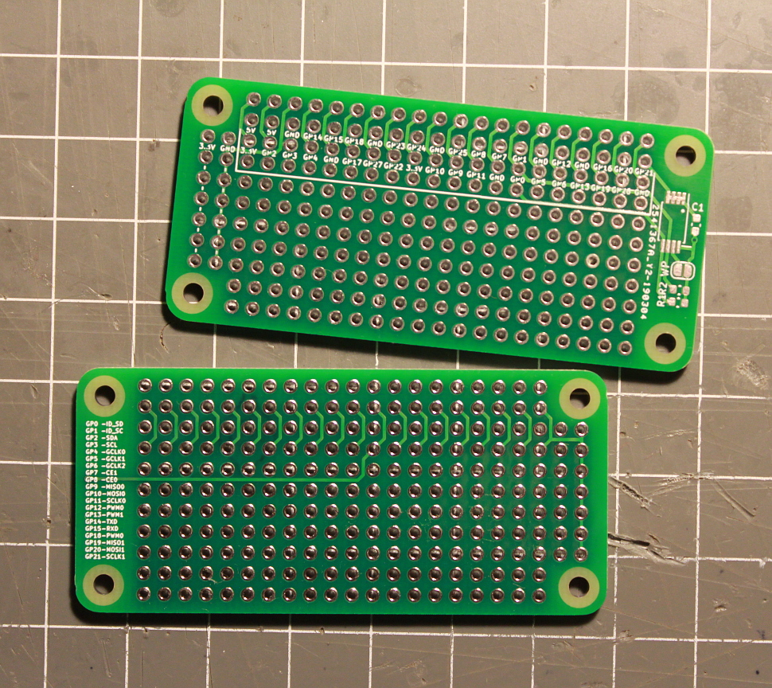

# Raspberry Pi Zero proto board

This is a simple proto board for Raspberry Pi Zero designed in [KiCAD](https://www.kicad-pcb.org/). This was my first project in KiCAD, so I probably didn't follow good practices. I did try to follow the [uHAT specification](https://github.com/raspberrypi/hats) though, so the board features a place for a TSSOP ID EEPROM. The pin description on silkscreen is probably smaller than the minimum of many PCB houses, but the $2 boards make by [JLCPCB](https://jlcpcb.com) turned out quite nice. All the signals are routed to pads below the connector to allow stacking pin headers, so there are only 7 rows of pins available for generic use. There are also two rows with power (3.3V and ground) on the side.

## License

The schematic and PCB layout are released into public domain. I'd love nothing more than to see it sold on [eBay](https://ebay.com) or [AliExpress](https://aliexpress.com) $0.99 for 5pcs.

The project uses modified KiCAD footprints licensed under CC-BY-SA 4.0.

